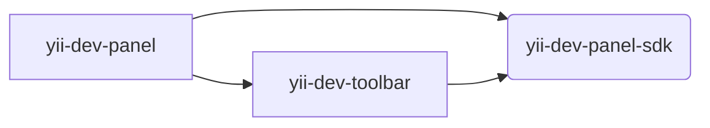

# Yii Development Panel Monorepo

This is a monorepo for Yii Development Panel and its SDK.

## Architecture

The project follows monorepository patterns. The project consists of several packages:

### `@yiisoft/yii-dev-panel`

[README](packages/yii-dev-panel/README.md)

The SDK package. It is used to simplify creating applications or custom panels.

### `@yiisoft/yii-dev-panel-sdk`

[README](packages/yii-dev-panel-sdk/README.md)

The `toolbar` application. It is used to display the toolbar on the page.

The package is used to display the toolbar on the page. It can be used separately from the `yii-dev-panel` application.

The `toolbar` application requires only `sdk` package.

### `@yiisoft/yii-dev-toolbar`

[README](packages/yii-dev-toolbar/README.md)

The main application.

The `app` application requires both `sdk` and `toolbar` packages.

### Examples

#### [`examples/remote-panel`](examples/remote-panel)

Example of remote components that may be used as a custom panel.

Read more about how to work with remote components [here](docs/shared_components.md).

#### Dependency graph:

## Additional docs:

- [How to use Local registry (`verdaccio`)](docs/local_registry.md)
- [How to work with remote components](docs/shared_components.md)
