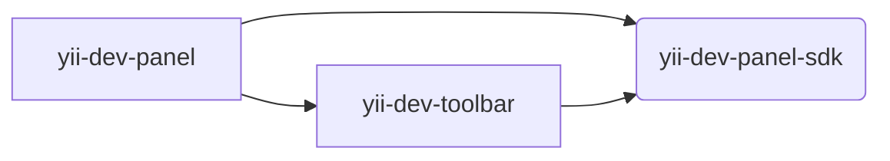

# Yii Development Panel Monorepo

This is a monorepo for Yii Development Panel and its SDK.


## Architecture

The project follows monorepository patterns. The project consists of several packages:

### `@yiisoft/yii-dev-panel`

[README](packages/yii-dev-panel/README.md)

The SDK package. It is used to simplify creating applications or custom panels.

### `@yiisoft/yii-dev-panel-sdk`

[README](packages/yii-dev-panel-sdk/README.md)

The `toolbar` application. It is used to display the toolbar on the page.

The package is used to display the toolbar on the page. It can be used separately from the `yii-dev-panel` application.


The `toolbar` application requires only `sdk` package.

### `@yiisoft/yii-dev-toolbar`

[README](packages/yii-dev-toolbar/README.md)

The main application.

The `app` application requires both `sdk` and `toolbar` packages.

#### Dependency graph:




## Contributing

0. First thing that you need is [`yiisoft/yii-debug-api`](https://github.com/yiisoft/yii-debug-api) running somewhere.

   For example, you can clone [`yiisoft/demo`](https://github.com/yiisoft/demo) and serve `blog-api` or `blog`.

   ```shell
   git clone git@github.com:yiisoft/demo demo
   ```

   ```shell
   cd demo/blog-api
   ```

   ```shell
   composer install
   ```

   ```shell
   ./yii serve
   ```

1. Clone the project

   ```shell
   git clone git@github.com:yiisoft/yii-dev-panel yii-dev-panel
   ```

2. Install dependencies

   ```shell
   npm install
   ```

3. Run dev server

   ```shell
   npm start
   ```

4. Feel free to make Pull Request
