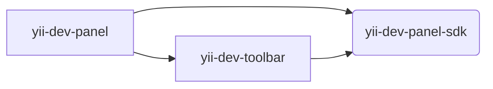

# Yii Development Panel Monorepo

This is a monorepo for Yii Development Panel and its SDK.

## Architecture

The project follows monorepository patterns. The project consists of several packages:

### `@yiisoft/yii-dev-panel`

[README](packages/yii-dev-panel/README.md)

The SDK package. It is used to simplify creating applications or custom panels.

### `@yiisoft/yii-dev-panel-sdk`

[README](packages/yii-dev-panel-sdk/README.md)

The `toolbar` application. It is used to display the toolbar on the page.

The package is used to display the toolbar on the page. It can be used separately from the `yii-dev-panel` application.

The `toolbar` application requires only `sdk` package.

### `@yiisoft/yii-dev-toolbar`

[README](packages/yii-dev-toolbar/README.md)

The main application.

The `app` application requires both `sdk` and `toolbar` packages.

### Examples

#### [`examples/remote-panel`](examples/remote-panel)

Example of remote components that may be used as a custom panel.

Read more about how to work with remote components [here](docs/guide/readme.md).

#### Dependency graph

## Documentation

- [Guide](docs/guide/README.md)
- [Internals](docs/internals.md)

## Support

If you need help or have a question, the [Yii Forum](https://forum.yiiframework.com/c/yii-3-0/63) is a good place for that.
You may also check out other [Yii Community Resources](https://www.yiiframework.com/community).

## Support the project

## Follow updates

## License

The Yii Development Panel is free software. It is released under the terms of the BSD License.
Please see [`LICENSE`](./LICENSE.md) for more information.

Maintained by [Yii Software](https://www.yiiframework.com/).
