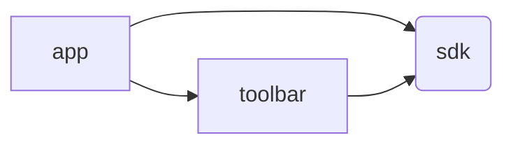

# Yii Development Panel

### About

Yii Development Panel – it is an application that aggregates such different modules as:

- Debug
    - Repeating request by the only click
    - Collectors
        - LogCollector:
            - All collected logs during the request
        - EventCollector
            - All collected events during the request
        - ServiceCollector
            - All called services from the container during the request
        - ValidatorCollector
            - All validator calls with data, rules and results
        - QueueCollector
            - Pushed and consumed messages
        - WebAppInfoCollector
            - Some info about web configuration
        - RequestCollector
            - Collected info about the request
        - RouterCollector
            - All routes have been configured
        - MiddlewareCollector
            - All middlewares applied to the request
        - AssetCollector
            - All registered assets during the request
        - WebViewCollector
- Inspector
    - Routes
        - Find and inspect groups, routes, middlewares and the action
    - Parameters
        - Find and inspect parameters (`params.php`)
    - Configuration
        - Find and inspect container configurations
    - Container
        - Find and inspect services, tags, etc., available in the container
    - FileExplorer
        - Explore the application sources
    - Translations
        - Explore all registered translations
    - Commands (tests, analysis, composer scripts, any your own)
        - Run and see the result of any available commands (phpunit, codeception, psalm, composer scripts, any other)
    - Database
        - Simplify view the database configured with either Active Record or Cycle ORM
    - Git
        - See status, current branch, remotes and branch
        - Checkout any branch
    - PHP Info
        - See the whole result of `phpinfo()`
    - Composer (requiring packages, `composer.json` and `composer.lock` inspection)
        - Explore both `composer.json` and `composer.lock` files
        - Switch any package version
- Gii
    - Generators
        - Controller generator

## Installation

```shell
npm install
```

## Usage

The application use HTTP API to work with the modules.

There are a few ways to use the Yii Dev Panel:

### Asset / Standalone application

To use the application you need to build the app and specify the URL your app running on.
Connect the apps and serve the built app any way you want: nginx, apache, node, php built-in server.

### PWA

Online-mode or as standalone application.

Open https://yiisoft.github.io/yii-dev-panel

1. Online-mode
    1. There is an app. Specify the PHP app URL and use Yii dev panel.
2. Standalone app
    1. Click "Install" button in the URL to install PWA application
    2. Run the application from the Applications
    3. Make sure your API works by clicking on "check mark"
    4. Use Yii dev panel

Both options also work with mobile phones.

## Architecture

The project follows monorepository patterns. The project consists of several packages:

### `@yii-dev-panel/sdk`

The SDK package. It is used to simplify creating applications or custom panels.

### `@yii-dev-panel/toolbar` - the toolbar application

The `toolbar` application. It is used to display the toolbar on the page.

The package is used to display the toolbar on the page. It can be used separately from the `app` application.

Add the following code to the page to display the toolbar:

```html
<div id="yii-dev-toolbar" style="flex: 1"></div>
<script src="https://yiisoft.github.io/yii-dev-panel/toolbar/bundle.js"></script>
<script src="https://yiisoft.github.io/yii-dev-panel/toolbar/bundle.css"></script>
```

The `toolbar` application requires only `sdk` package.

### `@yii-dev-panel/app`

The main application.

The `app` application requires both `sdk` and `toolbar` packages.

Dependency graph:



## Screenshot


## Contributing

0. First thing that you need is `yiisoft/yii-debug-api` running somewhere.

   For example, you can clone [`yiisoft/demo`](https://github.com/yiisoft/demo) and serve `blog-api` or `blog`.

   ```shell
   git clone git@github.com:yiisoft/demo demo
   ```

   ```shell
   cd demo/blog-api
   ```

   ```shell
   composer install
   ```

   ```shell
   ./yii serve
   ```

1. Clone the project

   ```shell
   git clone git@github.com:yiisoft/yii-dev-panel yii-dev-panel
   ```

2. Install dependencies

   ```shell
   npm install
   ```

3. Run dev server

   ```shell
   npm start
   ```

4. Feel free to make Pull Request
